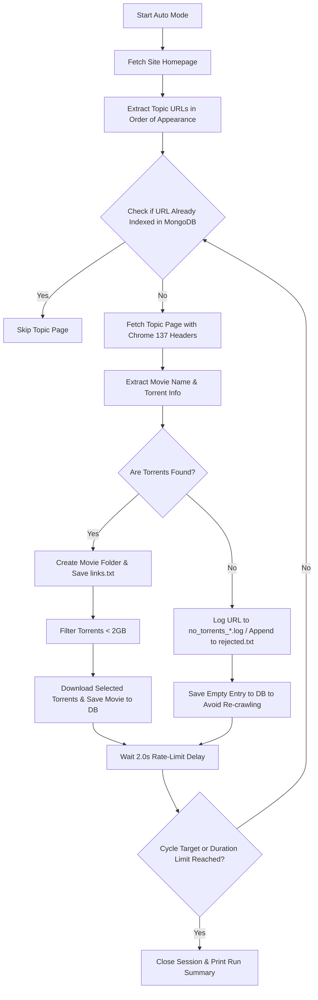

# Torrent Scraper - Complete Documentation

This document explains the technical flow, ordering sequence, and operational commands for the Torrent Scraper.

---

## 1. How the Scraper Works (Order of Scraping)

The crawler operates in a structured pipeline designed to be polite, sequential, and chronologically ordered (newest first).

### Pipeline Flowchart



### Scraping Order Details
1. **Homepage Loading:** The scraper fetches `WEBSITE_HOME_PAGE` (the 1TamilMV forum homepage).
2. **Chronological Sorting:** It parses the HTML source code from top to bottom. Because the homepage lists movie posts chronologically (newest updates/bumps first), the extracted links list preserves this order exactly.
3. **Database Guard (Deduplication):** Before fetching any movie page, the bot queries MongoDB. If the page URL exists in the database (whether it was successfully downloaded or previously rejected), it is skipped immediately to prevent redundant network requests.
4. **Rate Limiting:** A polite 2-second sleep delay is executed between page loads.
5. **Torrent Filtration:** It parses all torrent attachments on the page:
   - File size labels (e.g. `1.4GB`, `700MB`) are extracted.
   - If size is `< 2.0 GB`, the torrent is queued for download.
   - A backup index file `links.txt` containing the **source page URL** and **all available torrent links** is created in the movie folder for safety.
6. **Session Termination:** Once the cycle limit (default 10) or duration timeout is reached, the bot terminates and closes the HTTP connection pool safely.

---

## 2. CMD Commands to Use the Scraper

Run these commands in your Windows CMD or PowerShell terminal within the `web scrap` directory.

### Initialize/Setup
Make sure your MongoDB server is active, copy configuration variables, and install dependencies:
```cmd
copy .env.example .env
pip install -r requirements.txt
```

### Command 1: Run Auto Crawler (Chronological Scraping)
Starts indexing and downloading new torrents:
```cmd
python main.py auto
```
*Processes the default count of 10 movies.*

#### Custom Count Limit:
```cmd
python main.py auto --count 15
```
*Stops after checking 15 new movies.*

#### Custom Duration Limit (Seconds):
```cmd
python main.py auto --duration 120
```
*Stops after 120 seconds of running.*

#### Combined Count & Duration:
```cmd
python main.py auto --count 20 --duration 180
```
*Stops whichever limit is reached first.*

---

### Command 2: Search Database
Instantly check if a movie was already scraped and retrieve all its torrent links under 2GB:
```cmd
python main.py search "Breakfast"
```
```cmd
python main.py search "Reign of Terror"
```
